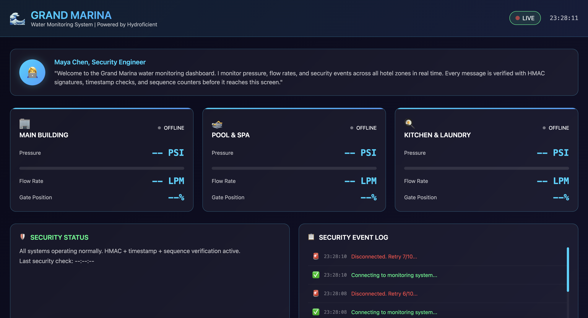
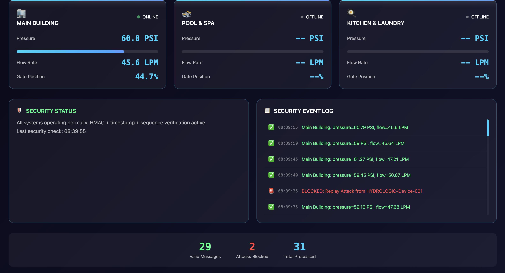
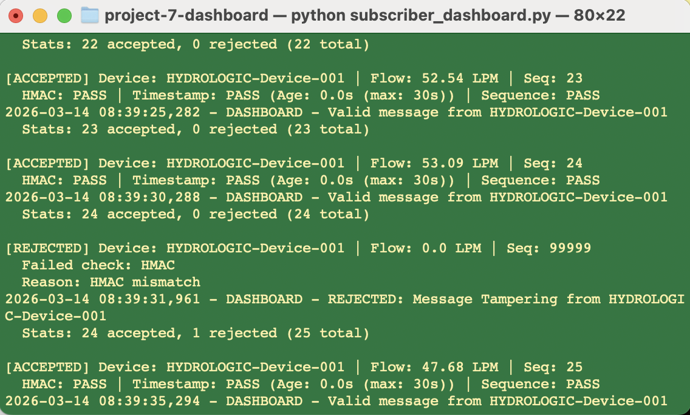
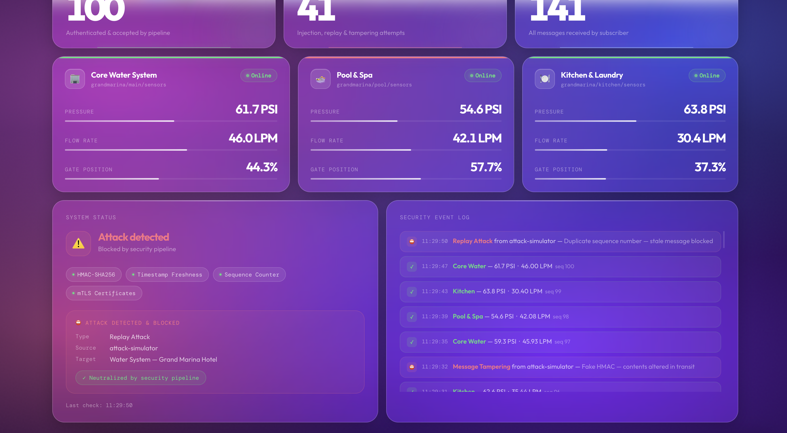

# Hydroficient AI Anomaly Detection

This project adds an AI-powered anomaly detection layer to a secured MQTT-based IoT pipeline and SOC dashboard.

## Overview

An Isolation Forest model is used to detect subtle anomalies in sensor data that rule-based controls cannot catch. The model is integrated directly into the subscriber and evaluates each message in real time after passing security checks.

## Features

- Isolation Forest anomaly detection model
- Real-time scoring of incoming sensor data
- Integrated with SOC dashboard
- Layered detection:
  - Green: Normal data
  - Orange: AI-flagged anomalies
  - Red: Rule-based blocked attacks

## Components

- `subscriber_dashboard_ai.py` – AI-enhanced subscriber with anomaly scoring
- `anomaly_model.joblib` – Trained Isolation Forest model
- `dashboard_server.py` – WebSocket server for dashboard updates
- `dashboard.html` – Dashboard UI
- `attack_simulator.py` – Generates attack scenarios
- `publisher_defended.py` – Secure MQTT publisher

## Model Details

- Algorithm: Isolation Forest
- Precision: 1.00
- Recall: 0.64
- F1 Score: 0.78

## Detection Architecture

1. Message received via MQTT (TLS/mTLS secured)
2. Rule-based validation:
   - HMAC verification
   - Timestamp freshness
   - Sequence/replay protection
3. If valid → AI model scoring
4. Dashboard visualization:
   - Green (normal)
   - Orange (AI anomaly)
   - Red (blocked attack)

## Notes

Private key material is intentionally excluded from this repository.

## Screenshots

